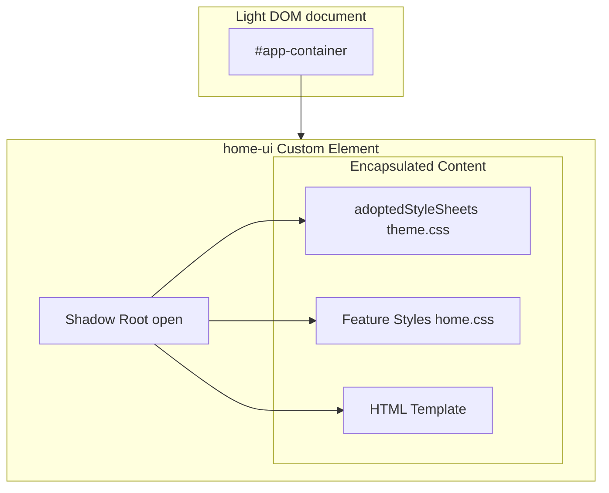
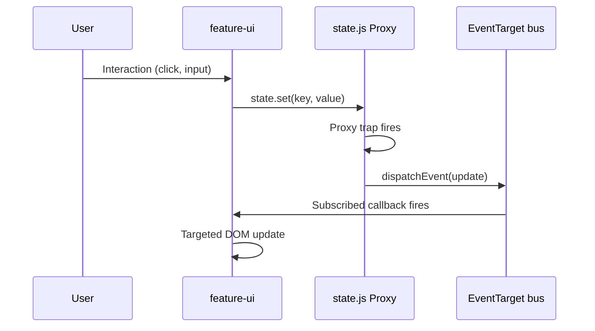
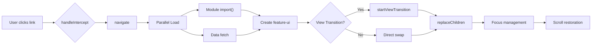

# Project Axiom

> **"Nullius in verba"** — take nobody's word for it. (The Royal Society's motto.)
> Fitting: the numbers on this page are checked by CI. Don't take our word either.

We once believed a `node_modules` folder the size of a small moon, a build step between every save and the browser, and stack traces through transpiled code were simply the price of a modern web app.

We were wrong.

Axiom is a small application runtime built from what browsers already ship — ES modules, import maps, Custom Elements, Shadow DOM, `Proxy`, `EventTarget`, `fetch`, the History API, View Transitions.

**Zero runtime dependencies. No framework build step required.** Optional tooling is provided for development, testing, validation, and production asset optimization.

| | |
|---|---|
| Runtime dependencies | <!-- claim:runtime-deps -->0<!-- /claim --> |
| Runtime core (`src/core/` + `BaseComponent`) | <!-- claim:core-lines -->~2,200<!-- /claim --> lines · <!-- claim:core-brotli-kb -->~12<!-- /claim --> KB Brotli as shipped, held under a 13 KB budget |
| Built-in UI controls | <!-- claim:controls -->25<!-- /claim --> |
| The entire app — every feature, every control — minified, compressed per file as a browser fetches it | <!-- claim:gzip-kb -->~87<!-- /claim --> KB gzip · <!-- claim:brotli-kb -->~73<!-- /claim --> KB Brotli |
| Browser floor | Chrome/Edge 111+, Safari 16.4+, Firefox 113+ (import maps, `adoptedStyleSheets`, `ElementInternals`, `color-mix()`) · tested in Chromium, WebKit and Firefox on every deploy |

---

## ⚡ The architecture (TL;DR)

### 1. State — `src/core/state.js`
Not a store library. A `Proxy` and an `EventTarget`.
- **Reactive — shallowly.** Assign a top-level key (`state.data.count = 5`) and subscribers hear it. Mutate *inside* an object (`state.data.user.name = 'x'`) and nobody does. That's the rule, not a bug: `state.update('user', u => ({ ...u, name: 'x' }))` is the supported way, and it warns you if you hand back the same object.
- **Optimistic.** `state.mutate()` shows the change instantly and runs your request. If the server says no, *that* change is undone — even with other writes to the same key still in flight. It's optimistic UI, not a transaction: the server stays the authority.
- **Queries.** `state.query()` tracks loading / success / error and caches by TTL.
- **Declared keys.** `state.define()` declares a key and where it persists. Core declares only its own keys; your app declares its own, in its own module — so nobody ever has to edit the framework file. (Eight projects that did are why eight copies of it stopped matching.)

### 2. Router — `src/core/router.js`
About <!-- claim:router-lines -->600<!-- /claim --> lines. You can read all of it before your current router's changelog finishes loading.
- **Parallel loading.** The route's module and its data load at the same time. No waterfall.
- **Race-safe.** Click A, B, C in quick succession; whichever request finishes last, you land on C.
- **Error contract.** A failed route falls back to your 404. If *that* fails, the router emits a cancelable `axiom:router-error` — `preventDefault()` and the outcome is yours. Unhandled, it draws a minimal notice in the app container, never over `document.body`.
- **View Transitions** where the browser has them; an instant swap where it doesn't — or where the browser hasn't started one within a second.
- **Focus and scroll.** Focus moves to the new page without yanking the viewport; a new page starts at the top, back/forward returns you to where you were.

### 3. Gateway — `src/core/gateway.js`
`fetch`, with the tedious parts done.
- **Headers handled** — the auth token and version stamp, attached for you.
- **Reads by content type** by default. When you *need* JSON, say so: `gateway.get('/me', {}, { expect: 'json' })`. Now a login page served with `200 OK` is a `GatewayError` naming what arrived — not a string that detonates three functions later.
- **Failures carry facts** — `status`, `contentType`, `url`, the first 2 KB of the body. Branch on fields, not on message text. Details: [docs/rest-readme.md](docs/rest-readme.md).

### 4. Components — `src/shared/base-component.js`
Custom Elements and Shadow DOM. No JSX, no virtual DOM, no hooks.
- **Targeted updates.** Components subscribe to the keys they care about, and `ref()` caches nodes so an update is a property write. Nothing *stops* a component from re-rendering its whole shadow root — the tools just make not doing that the easy path.
- **One theme, every shadow root**, through `adoptedStyleSheets`: parsed once, shared, no CSS-in-JS.
- **The controls** in `src/shared/controls/` — forms, data-viz, a Sankey, a gauge that looks like plasma. The agent-and-human contract table: [docs/CONTROLS.md](docs/CONTROLS.md).

### 5. Auth — `src/core/auth.js`
OAuth authorization code + PKCE with a per-login `state`, one refresh in flight at a time, and a token store you choose. The default is `localStorage`. Read [SECURITY.md](SECURITY.md) before deciding that's right for you — it says plainly what each choice buys and what none of them can.

---

## 🔒 Security

Deploys ship a Content-Security-Policy with no `'unsafe-inline'` scripts and no `eval`; the import map is admitted by its hash, recomputed after every rewrite and checked in CI. `notify()` renders text, never markup, and CI fails on any inline event handler in `src/`. The whole model — including what it does **not** protect — is in [SECURITY.md](SECURITY.md).

---

## 🚀 Quick start

You need one thing: a static server that falls back to `index.html` for deep links. (Browsers refuse ES modules over `file://`, because security.)

```bash
git clone https://github.com/cybercussion/axiom.git
cd axiom
node tools/serve.js   # zero-dependency SPA server that ships in the repo (`npm start`)
```

Open the URL it prints (`http://127.0.0.1:3000`). That's it. You're developing. Any other static server with SPA fallback works too.

Want live reload, lint and tests? That's the optional toolchain:

```bash
npm install
npm run dev           # browser-sync, live reload
npm test              # tool tests + core tests, in node
```

> If a page from some *other* project shows up on `localhost:3000`, that's its service worker squatting on the origin. Unregister it in DevTools → Application.

---

## 🧪 Tests

`npm test` runs the tool tests and the core tests; `npm run e2e` runs the browser suite (Playwright) with the app under its production CSP — Chromium by default, `AXIOM_ENGINES=chromium,webkit,firefox` for the matrix the deploy runs. The core's browser modules run under node through a resolve hook that applies the same import map the browser uses — tests import `@state` exactly as the app does, with no build step and no second module graph to drift. The deploy runs every test before anything ships, and one of them checks the numbers in this README. Two budgets fail the deploy: the runtime core past 13 KB Brotli, and a layout shift past 0.1 loading the heaviest pages. `npm run bench` reports how fast the state layer is without gating on it — timings move with the machine; bytes and layout do not.

---

## 🏗 Visual architecture

### Shadow DOM component encapsulation

Each feature component extends `BaseComponent`, which creates an isolated Shadow DOM boundary. Styles are shared via `adoptedStyleSheets`, preventing leakage while allowing theme inheritance.



### State → component reactive flow

The Proxy-based state uses `EventTarget` as a pub/sub bus. Components subscribe once; updates land where they're needed — no virtual DOM diffing.



### Router navigation lifecycle

Navigation loads modules and data in parallel, uses View Transitions when available, and handles focus and scroll for accessibility.



---

## 🛠 Feature generator

If you're lazy (and you should be), let the generator scaffold a feature:

```bash
# Creates src/features/profile/profile.js, .css, etc.
npm run feature profile
```

## 🔍 SEO & PWA

Don't hand-write forty lines of `<meta>` tags like a caveman. There's a wizard for that.

```bash
node tools/create-seo.js          # title, description, social images
node tools/create-seo.js --pwa    # manifest + service worker, opt-in
```

## 📦 Production build

**"Wait, you said no build step?"** Correct — you don't *need* one. The GitHub Pages showcase deploys the source itself; that's the point. But if you want your assets crushed into a fine powder:

```bash
npm run build                                                        # Terser + CSSO -> dist/, every module URL ?v=-stamped
node tools/csp.js dist/index.html --write --config axiom-config.js   # then add the Content-Security-Policy
```

That turns <!-- claim:source-kb -->~350<!-- /claim --> KB of source JS + CSS into <!-- claim:minified-kb -->~230<!-- /claim --> KB minified — ~87 KB gzipped, ~73 KB with Brotli, compressed per file the way a browser fetches it. That's the whole app; any one page loads a subset. It's non-destructive: it reads your source and writes `dist/`.

---

## 📝 Philosophy

**Use browser primitives, add only the missing application-level contracts, and make those contracts small, observable, cancellable, testable, and explicit.**

- **Browser primitives.** CSS custom properties, not Sass variables. ES modules, not CommonJS. A `Proxy` and an `EventTarget`, not a reducer-store library.
- **Small.** See the table at the top: the runtime core is an afternoon's reading.
- **Observable.** `state.subscribe()` for every change, `router.onNavigation()` for each navigation's start and commit, `axiom:router-error` for a failure the app should render.
- **Cancellable.** A newer navigation aborts the one in flight: its route loader receives the `AbortSignal` (`api(params, signal)`), and a navigation that loses never commits, focuses or scrolls. `axiom:router-error` is cancelable — `preventDefault()` and the outcome is yours.
- **Testable.** Node tests import the same specifiers the browser resolves; the browser suite runs under the production CSP; misuse of the public types is pinned so it cannot compile.
- **Explicit.** `expect` turns a response-type assumption into an assertion; `state.define()` is the one place a key's persistence is decided; where tokens persist is an option you pass, with what it does and doesn't protect written down.

The rules the runtime keeps — component lifecycle, state and router guarantees, accessibility, the browser floor, versioning — are written down in [docs/contracts.md](docs/contracts.md).

## 🚫 When NOT to use Axiom

- **Your team leans on React's ecosystem** — its component libraries, hooks and tooling. Axiom has a small set of built-in controls, not npm's catalog.
- **You need server rendering** or React Server Components. Axiom is a client runtime, by design.
- **Your content must render without JavaScript** for search or accessibility. Pages render in the browser; `create-seo` handles meta tags, not content.
- **You want TypeScript-first authoring.** The source is JavaScript. You get generated declarations to consume, not a compiler in your loop.
- **You want framework-managed deep state.** State is shallowly reactive on purpose; nested changes go through `state.update()`.
- **You want an ecosystem.** There are no stores, providers, middleware or plugins, and there won't be. Every addition is a function, an option, or an event on something that already exists.

## Reviewed, not trusted

Two external reviews have been worked through. The first graded this README 6/10 for accuracy; every criticism has a written disposition in [the ledger](docs/superpowers/specs/2026-09-11-review-response-design.md), and the second review's claims were tested before anything was built — [the validation](docs/superpowers/specs/2026-09-11-review-2-validation.md). The counts and sizes on this page are checked on every deploy: line counts within 10% by `tools/readme-claims.test.js`, shipped bytes against the real build, and the core against its budget, by `tools/weigh.js`. The browser floor was checked against MDN's compatibility data on 2026-09-11, and the full browser suite runs in Chromium, WebKit and Firefox on every deploy.

Enjoy your retrieved sanity.
