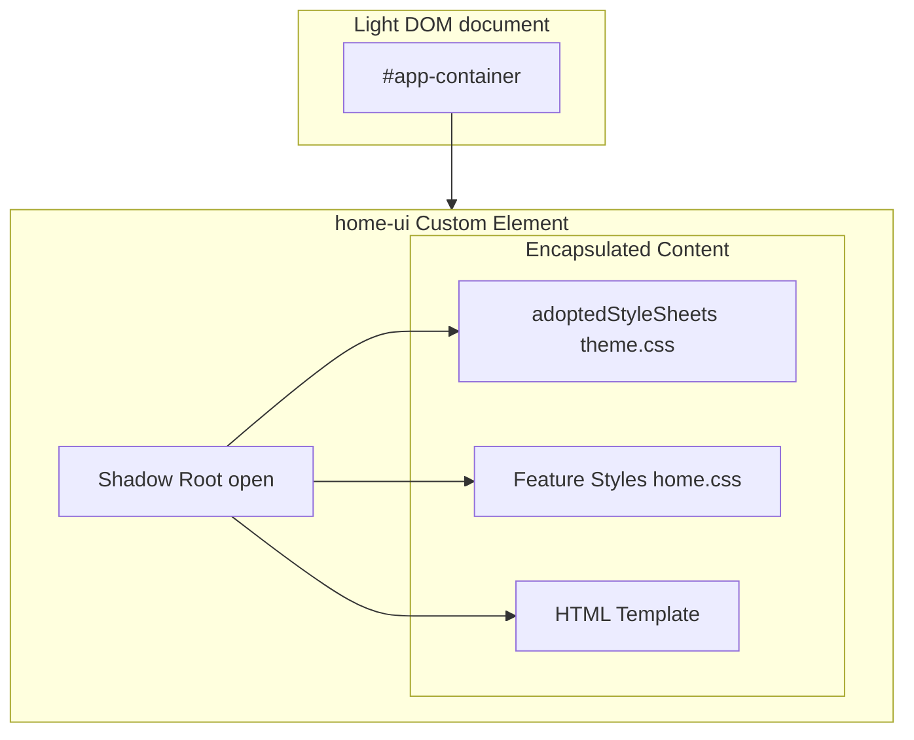
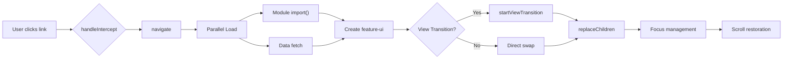

# Project Axiom

> **"Nullius in verba"** (Take nobody's word for it) — Royal Society Motto

Welcome to **Axiom**. We mistakenly decided that 500MB `node_modules` folders, 30-second builds, and debugging transpilation errors were "modern web development."

We were wrong.

Axiom is a **zero-build**, **zero-framework**, **vanilla Web Standards** architecture. It runs directly in the browser. It respects your RAM. It respects your time.

---

## 🎓 SCOBot Player 2 (this branch)

This branch (`scobot-player2`) is the SCORM-package lane of Axiom: an e-learning SCO player, still built on the same zero-framework core, but packaged to run *inside* an LMS instead of on the open web.

- **Template engine** — `choice`, `match`, `wordpuzzle`, `scorecard`, and `title` page types, each a Web Component driven by `data/scobot.json`.
- **SCORM tracking** — [`@cybercussion/scobot`](https://www.npmjs.com/package/@cybercussion/scobot) `^5.2.0` via its Content API (bookmarks, per-page suspend data, interactions, objectives, `gradeIt()` scoring). See [`SCOBot_README.md`](SCOBot_README.md) for the full integration guide.
- **SCORM build profile** — `BUILD_PROFILE='scorm'` in `tools/minify.js` emits relative asset paths and keeps the import map live at runtime, so the built package can be dropped into an LMS content directory at any path.
- **Packaging** — `npm run scorm` (SCORM 2004 default), `npm run scorm:12`, or `npm run scorm:2004` builds a SCORM-compliant ZIP from `dist/`.
- **Themed backgrounds** — per-course webp background art driven by course metadata.

This is the one dependency the "zero-dependency" pitch below doesn't apply to on this branch — the SCORM runtime needs an actual CMI client, and `@cybercussion/scobot` is it.

---

## ⚡ The Architecture (TL;DR)

### 1. The "State" (Reactivity)
**File:** `src/core/state.js`
It's not a global store library. It's a `Proxy`.
- **Reactive:** You touch `state.data.count`, the UI updates. Magic.
- **Optimistic:** `state.mutate()` updates the UI *instantly*. If the server hiccups, it rolls back automatically. We assume success because we're optimists.
- **Smart Queries:** `state.query()` handles the boring stuff (fetching, loading states, error handling, caching) so you don't have to.

### 2. The "Router" (Navigation)
**File:** `src/core/router.js`
It's roughly 200 lines of code. Popular alternatives are 30,000. existentially weigh those options.
- **Parallel Loading:** It fetches your JS module AND your data simultaneously. No waterfalls here.
- **Panic Mode:** If the route fails, we show a 404. If the 404 fails, we panic gracefully to avoid the White Screen of Death.
- **View Transitions:** Native browser animations on navigation. Smoother than butter.

### 3. The "Gateway" (API)
**File:** `src/core/gateway.js`
A wrapper around `fetch` that actually has a brain.
- **Content-Type Agnostic:** JSON? Text? Blob? It figures it out.
- **Unified Headers:** Handles your auth tokens and version stamping automatically.

### 4. The "Components" (UI)
**File:** `src/shared/base-component.js`
Web Components. Native Shadow DOM.
- **Surgical Updates:** We don't re-render the whole world. We find the node, we change the text. Fast.
- **Theme Injection:** Adopts global styles automatically. No css-in-js libraries required.

---

## 🚀 Quick Start

You don't need `npm run build` to develop. (This branch does need `npm install` once — the SCORM lane's Content API runs on `@cybercussion/scobot`, loaded straight from `node_modules` via the import map.)

1. **Get the code:**
   ```bash
   git clone https://gitlab.com/cybercussion/axiom.git
   ```

2. **Serve it:**
   (Browsers block ES Modules on `file://` protocol because security).
   (We use Vite or a SPA-aware server to ensure routing works correctly).
   ```bash
   npm install
   npm run dev
   ```

3. **Open it:**
   `http://localhost:3000`

That's it. You're developing.

---

## 🏗 Visual Architecture

### Shadow DOM Component Encapsulation

Each feature component extends `BaseComponent`, which creates an isolated Shadow DOM boundary. Styles are shared via `adoptedStyleSheets`, preventing leakage while allowing theme inheritance.



### State → Component Reactive Flow

The Proxy-based state uses `EventTarget` as a pub/sub bus. Components subscribe once; updates are surgical—no virtual DOM diffing.


### Router Navigation Lifecycle

Navigation loads modules and data in parallel, uses View Transitions when available, and handles focus/scroll restoration for accessibility.



---

## 🛠 Feature Generator

If you're lazy (and you should be), use the generator to make new distinct features.

```bash
# Creates src/features/profile/profile.js, .css, etc.
npm run feature profile
```

## 🔍 SEO & PWA Injection

Don't hand-write 40 lines of `<meta>` tags like a caveman. We have a wizard for that.

```bash
# Interactive Wizard (Title, Desc, Social Images)
node tools/create-seo.js

# Turn it into an installable PWA (Manifest generation)
node tools/create-seo.js --pwa
```


## 📦 Production Build

**"Wait, you said no build step?"**
Correct. You don't *need* it. But if you want to crush your assets into a fine powder for production:

```bash
# Minifies JS (Terser) & CSS (CSSO) -> /dist
npm run build
```

This is **non-destructive**. It reads your source and writes to `dist/`.

---

## 📝 Philosophy

**If the platform can do it, use the platform.**

- **Variables:** CSS Custom Properties. Not SASS Variables.
- **Modules:** ES Modules (ESM). Not CommonJS require().
- **State:** JS Proxy. Not a specialized reduced store library.

Enjoy your retrieved sanity.
