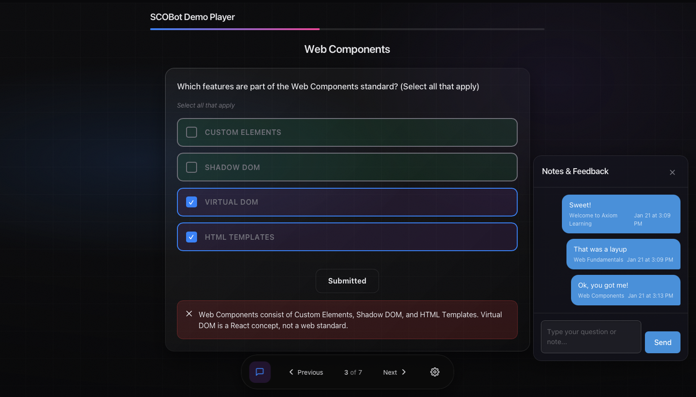

# SCOBot SCORM Integration Guide

This document explains how SCORM (Shareable Content Object Reference Model) is integrated into the Axiom e-learning player using [@cybercussion/scobot](https://www.npmjs.com/package/@cybercussion/scobot) ^5.2.0 — the Content API restoration release.



## What is SCORM?

SCORM is a set of technical standards for e-learning software that enables:

- **Tracking** - Record learner progress, scores, and completion status
- **Bookmarking** - Resume where the learner left off
- **Interoperability** - Content works across different Learning Management Systems (LMS)

### SCORM Versions

- **SCORM 1.2** - Legacy standard, simpler but limited
- **SCORM 2004** - Modern standard with sequencing and navigation rules

SCOBot supports both versions automatically, bridging 1.2 calls to 2004 syntax under the hood.

## Project Setup

### Installation

```bash
npm install @cybercussion/scobot
```

This player requires `@cybercussion/scobot` **^5.2.0** — the release that restored the higher-level Content API (`setInteraction`/`setObjective`/`setBookmark`/`setSuspendDataByPageID`/`gradeIt`) that everything below is built on.

### Import Map Configuration

In `index.html`:

```html
<script type="importmap">
{
  "imports": {
    "@scobot": "./node_modules/@cybercussion/scobot/dist/scobot.js"
  }
}
</script>
```

On the SCORM build lane this import map stays **live at runtime** — the build (`BUILD_PROFILE='scorm'` in `tools/minify.js`) uses relative paths so the package can be dropped into any LMS content directory, and it copies the SCOBot bundle alongside the SCO rather than resolving the alias away.

### Usage in Player

The player boots SCOBot from `src/features/player/player.js`, in `PlayerUI.initScorm()`:

```javascript
import { SCOBot } from '@scobot';

const options = {
  debug: debugEnabled,
  prefix: 'SCOBot',
  use_standalone: true,        // Failover to Mock API if no LMS found
  compression: true,           // Compress suspend_data (lz-string)
  exit_type: 'suspend',        // Safety default; finish() overrides at the end
  happyEnding: false,          // gradeIt() is the honest scoring path
  scaled_passing_score: passingScore,
  // completed = every objective completed. Only set when objectives
  // exist: a zero-interaction course never advances progress_measure,
  // so omit the key and let SCOBot's default threshold (0) apply.
  ...(totals > 0 ? { completion_threshold: 1 } : {})
};

const scorm = new SCOBot(options);

// initSCO() = initialize() + start(): learner info, entry/mode, suspend restore
const connected = scorm.initSCO();  // Returns 'true' or 'false' (strings!)
```

`completion_threshold` is set **conditionally**: courses made entirely of non-interactive pages (title pages, a scorecard) never advance `cmi.progress_measure`, so forcing a threshold of `1` would make them impossible to complete. Only courses with at least one interactive page (`choice`, `match`, `wordpuzzle`) get `completion_threshold: 1`; everything else falls back to SCOBot's default of `0`.

Once connected, the player logs entry/mode for debugging and declares totals so SCOBot can track `cmi.progress_measure` on its own:

```javascript
log.info(`SCORM initialized (entry: ${scorm.getEntry() || 'ab-initio'}, mode: ${scorm.getMode()})`);

scorm.setTotals({
  totalInteractions: String(totals),
  totalObjectives: String(totals),
  scoreMin: '0',
  scoreMax: '100'
});
```

## Key Concepts

### Important: All Values Are Strings!

SCORM requires all values to be strings. Always convert:
```javascript
scorm.setvalue('cmi.score.raw', String(85));  // ✓ Correct
scorm.setvalue('cmi.score.raw', 85);          // ✗ May fail
```

This applies to Content API calls too — `setTotals`, `setInteraction`, `setObjective`, `setBookmark`, etc. all expect string values for their numeric-looking fields.

## The Content API Flow

Rather than hand-rolling raw CMI writes and a JSON `suspend_data` blob, this player leans entirely on SCOBot's Content API. The full lifecycle lives across two files:

- `src/features/player/player.js` — boot, restore trigger, and exit
- `src/core/course-state.js` — page navigation, scoring, and restore logic

### 1. Boot: `initSCO()`

`PlayerUI.initScorm()` calls `scorm.initSCO()`, which combines `initialize()` and `start()` in one call — learner info, entry/mode detection, and (internally) suspend-data restore. See [Project Setup](#usage-in-player) above for the call.

### 2. Declare totals: `setTotals()`

Immediately after connecting, the player tells SCOBot how many interactions/objectives the course has (`setTotals`, above) so it can maintain `cmi.progress_measure` automatically as objectives complete.

### 3. Track position: `setBookmark()` + `setSuspendDataByPageID()`

Every navigation and every page completion writes through the Content API — no manual JSON blob. From `src/core/course-state.js`:

```javascript
// courseActions.goToPage()
scorm.setBookmark(String(index));
scorm.commit();

// courseActions.markPageComplete()
scorm.setSuspendDataByPageID(page.id, page.title || page.type, progress[pos]);
```

`setBookmark` tracks *where* the learner is; `setSuspendDataByPageID` stores a per-page state record keyed by page ID, so restoring doesn't depend on position matching page order.

### 4. Track answers: `setInteraction()` + `setObjective()`

`courseActions.recordInteraction()` records both the raw interaction and a per-page objective for every question response:

```javascript
// SCOBot's setInteraction persists `data.weighting`, not `data.weight` —
// pass both so templates' `weight` field actually reaches the CMI.
scorm.setInteraction({ ...interaction, weighting: interaction.weight });

scorm.setObjective({
  id: interaction.objective || interaction.id,
  score: { scaled: correct ? '1' : '0', raw: correct ? '1' : '0', min: '0', max: '1' },
  success_status: correct ? 'passed' : 'failed',
  completion_status: 'completed',
  progress_measure: '1',
  description: course.currentPage?.title || ''
});
scorm.commit();
```

**Weight → weighting boundary:** templates (`src/features/templates/template-base.js`) build interaction objects with a `weight` field, but SCOBot's `setInteraction()` only persists a field named `weighting`. `recordInteraction()` bridges this by spreading the interaction and adding `weighting: interaction.weight` alongside the original `weight` key — don't rename `weight` on the template side or the CMI write silently drops the scoring weight.

One objective is written per interactive page, keyed by `interaction.objective || interaction.id` — this is what makes per-question mastery visible in LMS gradebooks, not just an aggregate score.

### 5. Score and gate completion: `cmi.score.raw` + `gradeIt()`

`courseActions.finalizeScore()` is the single place that pushes score through the Content API:

```javascript
scorm.setvalue('cmi.score.raw', String(course.score));
if (course.completionPercent === 100) {
  scorm.gradeIt();
}
scorm.commit();
```

`cmi.score.raw` is written on **every** call — it's a running score, updated per page. `gradeIt()` — which derives `cmi.score.scaled`, `cmi.success_status`, and stamps `cmi.completion_status` — only fires once `completionPercent` hits 100. At that point the `completion_threshold` semantics from step 1 line up correctly: threshold `0` (non-interactive courses) completes as soon as the course is finished, and threshold `1` (interactive courses) requires all objectives complete, which 100% page completion implies.

### 6. Exit: `finish()` / `suspend()`

`PlayerUI.disconnectedCallback()` decides how the session ends:

```javascript
if (course.isReviewMode) {
  scorm.suspend();                      // review: never rewrite status
} else if (course.completionPercent === 100) {
  courseActions.finalizeScore();        // cmi.score.raw + gradeIt()
  scorm.finish();                       // exit normal — the attempt ends
} else {
  scorm.suspend();                      // save-and-resume
}
```

`finish()` commits and terminates the attempt (used only when the course is actually done). `suspend()` commits and leaves the attempt resumable — used both for normal save-and-exit and, unconditionally, in review mode.

### 7. Restore: `getBookmark()` / `getSuspendDataByPageID()` / `getInteraction()`

`courseActions.restoreFromScorm()` (called from `initScorm()` right after `setTotals`) rebuilds state from the Content API on relaunch:

```javascript
// Per-page progress
const saved = scorm.getSuspendDataByPageID(page.id);

// Answers
const found = scorm.getInteraction(String(page.id));

// Position
const bookmark = scorm.getBookmark();
```

Each lookup is wrapped in its own `try/catch` — a legacy pre-Content-API `cmi.suspend_data` shape (the old `{ position, progress, interactions }` blob) has no `.pages` array, and SCOBot's page-keyed getters don't null-check against that structure. A malformed legacy record must never crash the player; it just falls back to starting fresh.

## Review Mode

When the LMS launches with `mode=review`, `course.isReviewMode` (in `src/core/course-state.js`) returns true:

```javascript
get isReviewMode() {
  const scorm = this.scorm;
  return !!scorm && typeof scorm.getMode === 'function' && scorm.getMode() === 'review';
}
```

Every write path in `course-state.js` — `goToPage`, `markPageComplete`, `recordInteraction`, `finalizeScore` — checks `!course.isReviewMode` before touching the Content API. Review mode renders whatever was restored and writes nothing back; on exit, `disconnectedCallback` always calls `scorm.suspend()` for review sessions regardless of completion, so a reviewer can never accidentally flip a completed attempt's status.

`scorm.getEntry()` (returns `'ab-initio'`, `'resume'`, or empty) is logged at boot alongside `getMode()` for debugging entry/mode combinations.

## Standalone Mode

When no LMS is detected, `use_standalone: true` enables SCOBot's Mock API, which:

- Stores the entire mock CMI (interactions, objectives, suspend data) in `localStorage` under the key `SCOBot_Mock_Data`
- Simulates LMS responses so `initSCO()`, `commit()`, etc. behave the same as a real LMS
- Allows full testing without an LMS

### Reset behavior

`resetCourseState()` in `src/core/course-state.js` clears in-memory course state and, for a genuinely fresh attempt, also clears SCORM data — but never in review mode (restored state there is read-only). The standalone case needs a specific ordering:

```javascript
// Terminate the standalone session BEFORE wiping the store: the mock saves on
// terminate, and SCOBot's beforeunload/unload auto-suspend would otherwise
// re-persist the still-active session's in-memory CMI (stale interactions/
// objectives included) on the reload that follows reset.
if (scorm && scorm.settings?.standalone && scorm.isConnectionActive()) {
  scorm.terminate();
}
localStorage.removeItem('SCOBot_Mock_Data');
```

Terminating first means the unload handlers no-op on the reload that follows — otherwise the stale in-memory session would re-save itself over the just-cleared `localStorage` key. This `clearStorage` path only runs in standalone/mock mode; a real LMS-mode reset skips the `localStorage` wipe (that reset control doesn't exist there) but still clears the CMI values it can (`completion_status`, `success_status`, `score.raw`/`scaled`, `progress_measure`, and any learner comments) and empties SCOBot's in-memory suspend pages via `setSuspendData()`.

## Raw CMI escape hatch

The Content API (`setInteraction`, `setObjective`, `setBookmark`, `setSuspendDataByPageID`, `gradeIt`, ...) covers everything this player needs, but SCOBot still exposes the raw `setvalue`/`getvalue` pair for anything the Content API doesn't wrap — comment counts, individual CMI paths, or one-off reads:

```javascript
scorm.getvalue('cmi.comments_from_learner._count');
scorm.setvalue('cmi.completion_status', 'incomplete');
```

`resetCourseState()` uses this escape hatch directly to blank out learner comments and force-reset status fields (SCORM has no "delete a value" operation, so blanking is the pattern). The strings-only rule from [Key Concepts](#important-all-values-are-strings) applies here too — raw `setvalue()` calls fail silently on non-string input just like the Content API does.

## Launch Parameters

SCORM/AICC LMS systems pass parameters via URL querystring. The `launch-params.js` utility handles these:

### Common Launch Parameters

| Parameter | Aliases | Description |
|-----------|---------|-------------|
| `debug` | - | Enable debug mode |
| `endpoint` | `url` | LMS API endpoint |
| `auth` | `token` | Authentication token |
| `learner_id` | `actor`, `student_id` | Learner identifier |
| `learner_name` | `student_name` | Learner display name |
| `registration` | `enrollment_id` | Enrollment/registration ID |
| `activity_id` | `course_id`, `sco_id` | Course identifier |
| `attempt` | - | Attempt number |
| `mode` | `launch_mode` | Launch mode (normal/browse/review) |
| `return_url` | `exit_url` | URL to return to after completion |

### Usage

```javascript
import { launchParams } from '@core/launch-params.js';

// Check debug mode
if (launchParams.debug) {
  console.log('Debug enabled');
}

// Get specific params
const learnerId = launchParams.learnerId;
const mode = launchParams.mode;  // 'normal', 'browse', 'review'

// Get any custom param
const customValue = launchParams.get('custom_param', 'default');

// Log all params (debug)
launchParams.log();

// Get SCORM-specific params as object
console.log(launchParams.scormParams);
```

Example: `http://localhost:3000/player?mode=review&registration=reg456&debug`

## Debug Mode

Enable debug logging to see all SCORM communications:

### Via URL Parameter

```
http://localhost:3000/player?debug
```

### Via Config

In `src/core/config.js`:
```javascript
DEBUG: true  // Automatically true on localhost
```

### Console Output

With debug enabled, you'll see:
```
SCOBot: initSCO()
SCOBot: getSuspendDataByPageID('page-3')
SCOBot: setBookmark('3')
SCOBot: commit()
```

## Testing with a Real LMS

To test your SCORM package against a real LMS runtime:

| Platform | URL | Description |
|----------|-----|--------------|
| **Cybercussion** | [cybercussion.com](https://cybercussion.com) | Website/Products/Info |
| **SCOBot Portal** | [scobot.cybercussion.com](https://scobot.cybercussion.com) | Interactive SCORM runtime for testing content and creating sessions |

These platforms allow you to:
- Upload your SCORM package (ZIP)
- Launch and test tracking
- View runtime data model values
- Debug LMS communication issues

## File Structure

```bash
src/
├── core/
│   └── course-state.js      # Content API sync/restore logic (goToPage, markPageComplete,
│                             # recordInteraction, finalizeScore, restoreFromScorm, resetCourseState)
├── features/
│   ├── player/
│   │   └── player.js        # SCOBot boot (initScorm), exit lifecycle (disconnectedCallback)
│   └── templates/
│       ├── template-base.js # interaction shape (recordInteraction, markComplete)
│       └── template-*.js    # Individual question types
data/
└── scobot.json               # Course content definition
```

## Course Content Format

The `scobot.json` file defines course structure:

```json
{
  "meta": {
    "title": "Course Title",
    "passingScore": 80,
    "scormVersion": "2004"
  },
  "settings": {
    "requireAnswerToAdvance": true,
    "showFeedback": true
  },
  "pages": [
    {
      "id": "unique-id",
      "type": "choice",
      "question": "...",
      "choices": [...],
      "weight": 1
    }
  ]
}
```

## Supported Template Types

| Type | Description | Interaction Type |
|------|-------------|------------------|
| `title-page` | Intro/section headers | None (auto-complete) |
| `choice` | Multiple choice/select | `choice` |
| `match` | Drag-and-drop matching | `matching` |
| `wordpuzzle` | Fill-in-the-blank | `fill-in` |
| `scorecard` | Results summary | None (finalizes course) |

## Packaging for LMS

Use the included packaging tool:

```bash
npm run scorm          # 2004 package (default)
npm run scorm:12       # SCORM 1.2 package
npm run scorm:2004     # SCORM 2004 package
```

Run `npm run build` first — the packager reads from `dist/`, not `src/`. This creates a SCORM-compliant ZIP with:

- `imsmanifest.xml` - Package manifest
- Schema files
- Course content files

## Troubleshooting

### "scorm.set is not a function"

Use `setvalue()` not `set()` for raw CMI access, or the Content API method that matches what you're writing:
```javascript
scorm.setvalue('cmi.location', '5');   // ✓ raw CMI
scorm.setBookmark('5');                // ✓ Content API equivalent
scorm.set('cmi.location', '5');        // ✗ not a method
```

### Data not persisting

1. Check `scorm.isConnectionActive()` returns true
2. Call `scorm.commit()` after setting values (`setInteraction`/`setObjective`/`markPageComplete` paths already do this — check your own custom writes)
3. Verify `use_standalone: true` for local testing

### Session not restoring

1. Check `restoreFromScorm()` is running BEFORE first render (it's called from `initScorm()`, before `renderCurrentPage()`)
2. Check the browser console for the `try/catch` warnings around legacy suspend_data — a pre-Content-API save will log and fall back to a fresh start rather than restore
3. In standalone mode, check `localStorage['SCOBot_Mock_Data']` actually has data

### Score showing 0%

1. Interactions must have `result: 'correct'` or `'incorrect'`
2. `course.score` (in `src/core/course-state.js`) parses `weight` with `parseFloat()` — make sure templates set a numeric-looking `weight`
3. Check interactions array is being restored via `getInteraction()`

### Course won't complete / stuck at "incomplete"

1. Check whether the course has any interactive pages — `completion_threshold` is only set to `1` when it does; a non-interactive course relies on threshold `0`
2. `gradeIt()` only fires inside `finalizeScore()` once `completionPercent === 100` — confirm every page's `progress[pos].complete` is actually true

## Resources

- [SCOBot Documentation](https://github.com/cybercussion/SCOBot)
- [SCORM Overview](https://scorm.com/scorm-explained/)
- [SCORM 2004 Data Model](https://scorm.com/scorm-explained/technical-scorm/run-time/run-time-reference/)
- [ADL SCORM Resources](https://adlnet.gov/projects/scorm/)

## License

SCOBot is available under the CC-BY-SA-4.0 License.
